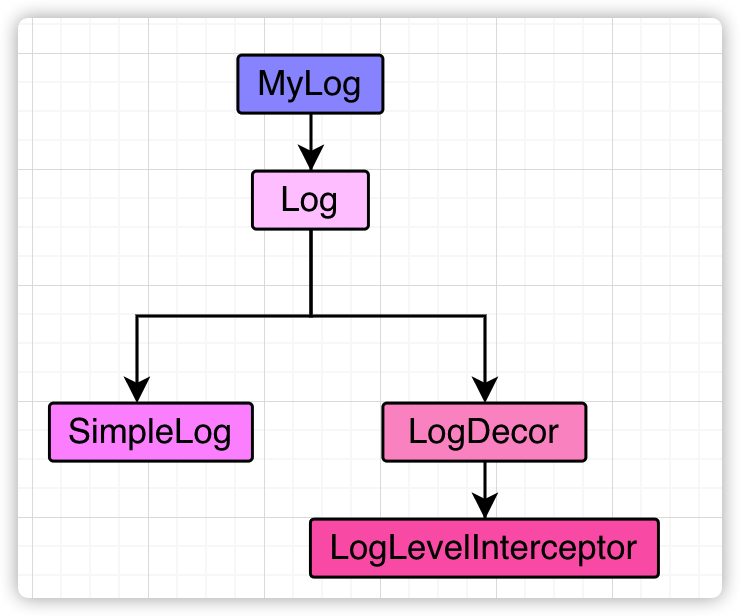

# 初始化仓库

```bash
//recurse way
git clone url --recurse-submodules

//init way
git clone url
git submodule init
git submodule update
```

# 架构


# 功能模块

| 界面                          | 功能描述                       |
| ----------------------------- | ------------------------------ |
| MainActivity                  | 主导航界面，用于跳转到各个功能 |
| RtmpPushActivity              | Rtmp推流                       |
| MusicClipActivity             | 音频剪裁                       |
| CameraTestActivity            | 摄像头测试                     |
| VideoCallActivity             | 视频通话                       |
| ScreenProjectionWatchActivity | 投屏观看界面                   |
| ScreenProjectionPushActivity  | 投屏推流界面                   |
| FastTestActivity              | 用于快速测试的界面             |


# 底层库

### x264

x264和MediaCodec都可以用来编码h264码流，但是两者编码出的数据有差异。


MediaCodec编码输出视频流，SPS和PPS是在码流的最开始的位置，而之后就不会再出现了。而正常的视频直播流里面对于码流类型的要求至少是这样的：SPS, PPS, I Frame。

因此对于MediaCodec编码出的数据，我们需要做额外的处理，将SPS和PPS保存在当前会话，然后每次检测到编码出了I帧，就将SPS和PPS插入在I帧之前。这样生成的视频流就符合了直播的要求。


而x264编码出的视频流，可以有两个选项：

```c
x264_param_t param;
// 将SPS和PPS放在每一个关键帧之前
param.b_repeat_headers = 1;
// 不将SPS和PPS放在每一个关键帧之前
param.b_repeat_headers = 0;
```

x264_param_t.b_repeat_headers变量的注释是这样的：

`/* put SPS/PPS before each keyframe */`


经过测试，开关打开，则可以输出正常可用的直播码流。

如果开关关闭，输出的码流中不包含SPS和PPS。如果你想要让X264输出的码流格式和MediaCodec的那样，只在开头输出SPS和PPS，那么你需要将SPS和PPS自己取出来，然后回调出去。

通过：

```c
/* x264_encoder_headers:
 *      return the SPS and PPS that will be used for the whole stream.
 *      *pi_nal is the number of NAL units outputted in pp_nal.
 *      returns the number of bytes in the returned NALs.
 *      returns negative on error.
 *      the payloads of all output NALs are guaranteed to be sequential in memory. */
X264_API int x264_encoder_headers( x264_t *, x264_nal_t **pp_nal, int *pi_nal );
```

将SPS和PPS数据取出并放在码流开头，就和MediaCodec的效果一样了。


### Log


日志模块的对外的API是MyLog。

- MyLog：是声明在log_abs.h文件中的命名空间，他有一个对Log接口的引用。

而Log的具体实现类是可以配置的，可以选择实现类型。

目前项目中的实现，是`SimpleLog`与用装饰者模式的`LogLevelInterceptor`结合的实现。

- Log：Log是一个抽象类，他的函数是纯虚函数。

- SimpleLog：是对NDK中的`__android_log_print`的一个简单封装。

- LogDecor：是对Log接口实现的装饰器模式。

- LogLevelInterceptor：是日志级别过滤器，用于过滤掉对应级别的日志。

