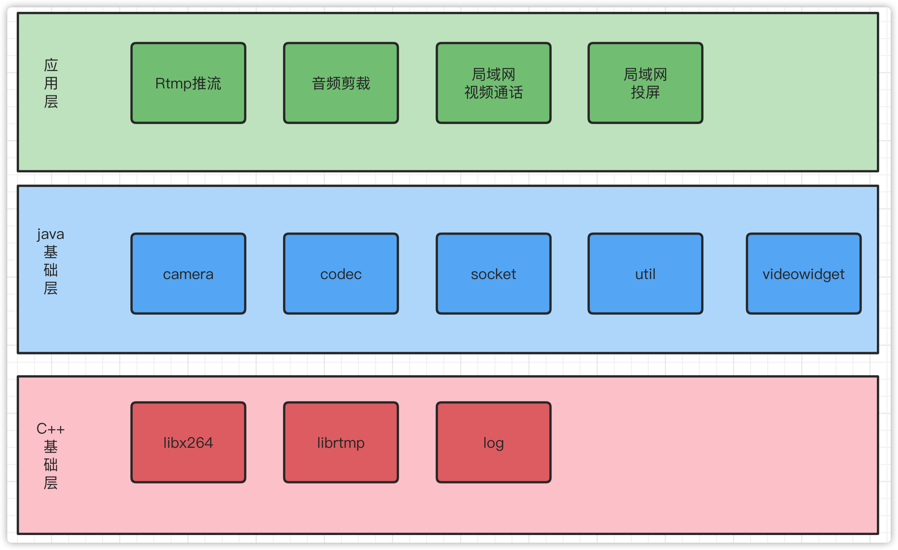

# 初始化仓库

```bash
//recurse way
git clone url --recurse-submodules

//init way
git clone url
git submodule init
git submodule update
```

# 架构



# 功能模块

| 界面                          | 功能描述                       |
| ----------------------------- | ------------------------------ |
| MainActivity                  | 主导航界面，用于跳转到各个功能 |
| RtmpPushActivity              | Rtmp推流                       |
| MusicClipActivity             | 音频剪裁                       |
| CameraTestActivity            | 摄像头测试                     |
| VideoCallActivity             | 视频通话                       |
| ScreenProjectionWatchActivity | 投屏观看界面                   |
| ScreenProjectionPushActivity  | 投屏推流界面                   |
| FastTestActivity              | 用于快速测试的界面             |

